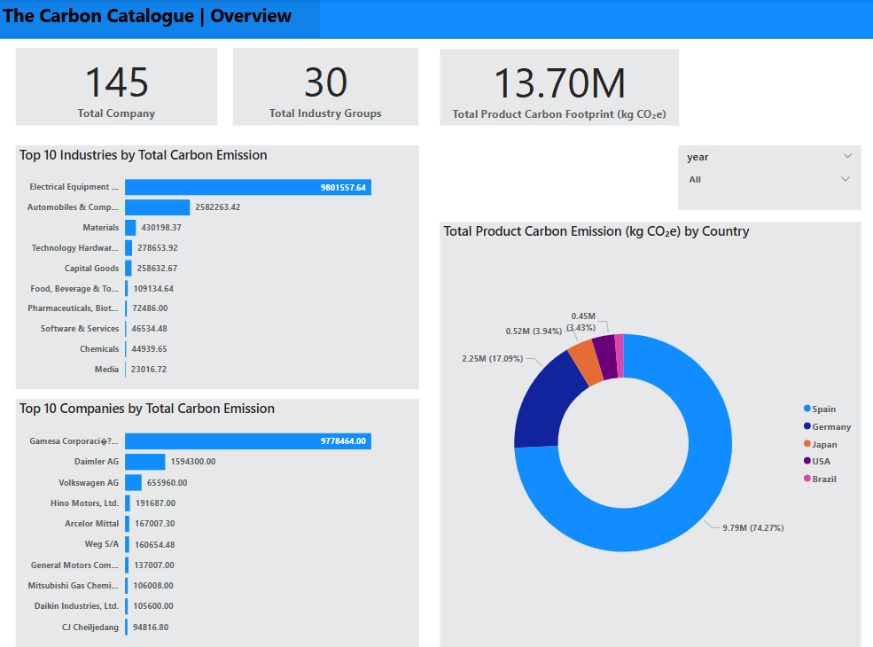

# Carbon Emissions Analysis & Visualization (Power BI)
 

## Project Overview
This project demonstrates my skills in Power BI through a comprehensive analysis of a carbon footprint dataset. The goal is to explore how greenhouse gas emissions are distributed across industries, companies, countries, and product lifecycle stages and to identify key contributors and opportunities for reduction.

 ### Tools & Techniques Used

Power BI: Data modeling, DAX for custom measures, building interactive dashboards and reports.

## Dataset Overview
Source: The Carbon Catalogue (Nature.com)
Dataset: Contains product carbon footprints (PCFs) for various products and companies, measuring CO₂-equivalent emissions across stages of production.

 | Field                          | Description |
|-------------------------------|-------------|
| `id`                          | Unique identifier for each product record. |
| `year`                        | Reporting year for the carbon footprint data. |
| `product_name`                | Name of the product being analyzed. |
| `company`                     | Company responsible for the product. |
| `country`                     | Country where the product is manufactured or reported. |
| `industry_group`              | Industry category (e.g., electronics, food, footwear). |
| `weight_kg`                   | Weight of the product in kilograms. |
| `carbon_footprint_pcf`        | Total carbon footprint in CO₂-equivalent (CO₂e), covering production to disposal. |
| `upstream_percent_total_pcf` | Emissions from upstream activities (e.g., raw materials, supply chain). |
| `operations_percent_total_pcf`| Emissions during internal operations (e.g., manufacturing, packaging). |
| `downstream_percent_total_pcf`| Emissions from downstream activities (e.g., transport, usage, disposal). |

## Project Steps
1. Data Exploration & Cleaning
 - Checked for missing values and duplicate records.

 - Cleaned inconsistent values (e.g., trimming company/industry names).

 - Standardized data types and handled percent values stored as strings.

2. Visualization in Power BI
 - Created interactive dashboards to visualize:

 - Emissions by industry, company, and country.

 - Stage-wise breakdown of emissions.

 - Trends over time and comparison between industries.

 - Applied DAX to create custom measures for average percentages, rankings, and totals.

## Key Analyses & Insights
 
 
✅ Electronics, machinery, automobiles, and materials are among the top 10 industries with the highest carbon emissions.

✅ The upstream stage (raw materials and supply chain) accounts for over 40% of emissions in most industries.

✅ Downstream emissions (distribution, usage) are particularly high in industries like Capital Goods and Automobiles.

✅ Significant emission differences exist across countries and companies, suggesting the potential for better sourcing and production decisions.

## Conclusion
This project highlights the importance of data in driving sustainability. Analyzing product-level carbon footprints across industries reveals areas where environmental impact can be reduced through more innovative sourcing, cleaner operations, or better end-of-life disposal strategies.
